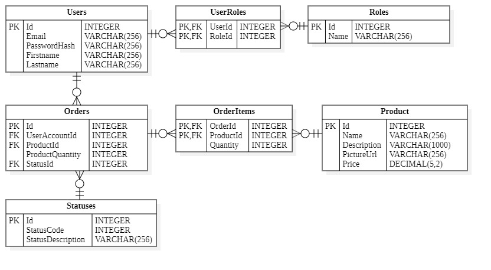

# Веб-технологии (Лабораторные работы)
### Задание
Разработать систему **интернет-магазин**. Администратор осуществляет ведение каталога товаров. Клиент делает и оплачивает заказ на товары. Администратор может занести неплательщиков в "черный список". 

---

### Архитектура базы данных

  

